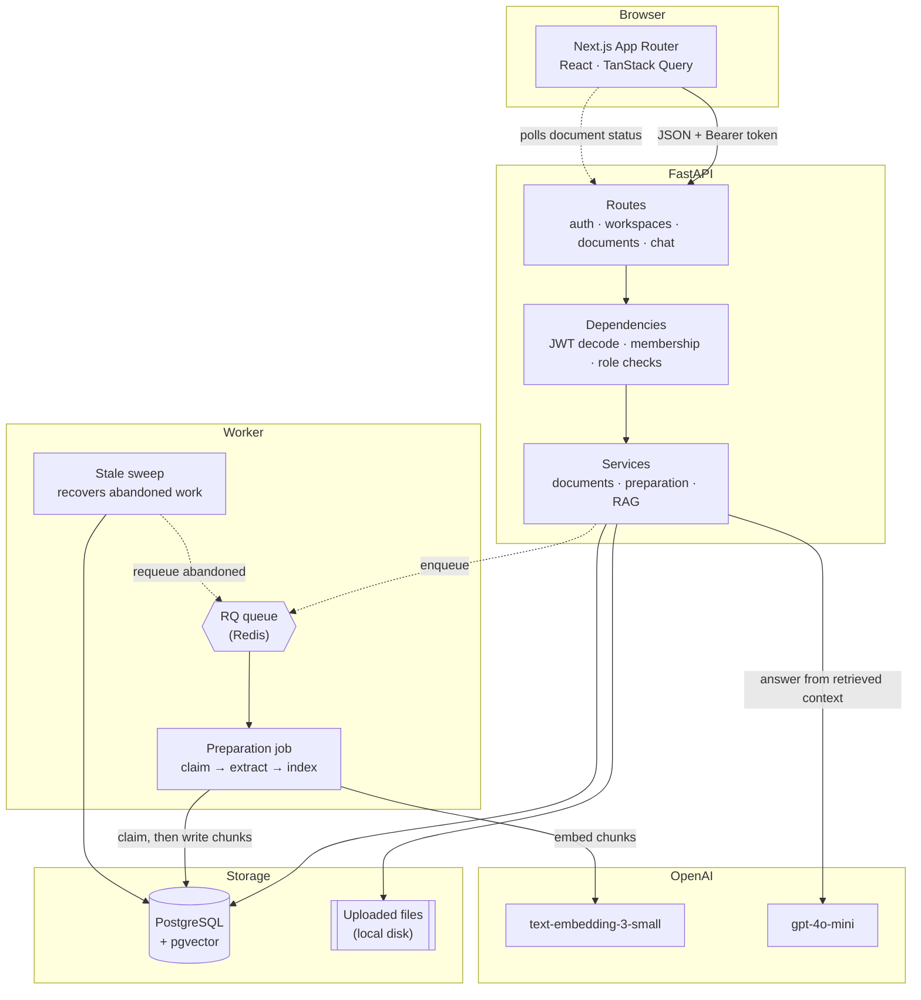
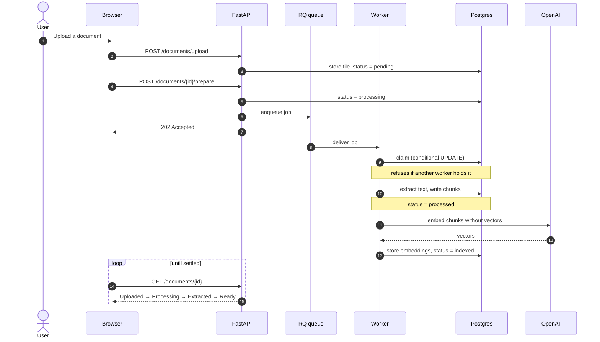

# SupportMind

**Upload your support documents, then ask them questions and get answers with the passages they came from.**

A multi-tenant RAG application: FastAPI and Postgres/pgvector behind a Next.js product surface that never asks the user to understand retrieval, embeddings, or indexing.

[](https://github.com/ZakwanZahid/ai-support-agent-rag/actions/workflows/ci.yml)


-blue)

<!-- Placeholders until Phase 18 deploys. Do not link these until they resolve. -->
🔗 **Live demo** — _not deployed yet_ · 🎥 **Demo video** — _not recorded yet_

<!--
  Screenshot goes here once Phase 18 deploys and seeds the demo workspace, so
  it shows real data. Kept as a comment rather than an  tag so the README
  does not render a broken image in the meantime:
  
-->

---

## The problem

Most teams already have the documentation that answers their support questions. It's in a PDF, a wiki page, and one person's head. Finding the answer means knowing which of those to open.

General-purpose AI tools make that worse rather than better: ask one about your refund window and it will confidently describe a policy your company never had. And an answer you can't check is an answer you still have to verify by hand.

There's a third problem, which is the one this project is really about. The obvious way to build a retrieval app leaks its own machinery into the interface — upload a file, click **Ingest**, wait, click **Index**, wait, then chat. Those are two operations because they have different failure modes, which is a good backend design and a terrible product. The user's intent is *"make this document answerable"* — one thing, not two.

## What I built

A support assistant that answers only from documents you gave it, and shows the passage behind every answer.

The engineering interest isn't the RAG pipeline — that part is well-trodden. It's the layer above it: taking a system whose natural vocabulary is *organizations, knowledge bases, ingestion, indexing, citations* and presenting it as *workspaces, knowledge spaces, "Prepare for chat", sources* — without the translation rotting the first time someone adds a component.

## Architecture



Every tenant-owned row carries an `organization_id`, and membership is checked on every request before a service runs. Embeddings live in the same Postgres instance as the chunk metadata, through pgvector — one datastore, transactional with the rest of the data.

### How "Prepare for chat" works

The single user-facing action, and the piece I'd point a reviewer at first:



Chaining happens server-side, deliberately. Orchestrating it from the browser means the sequence breaks if the tab closes between the two calls. If extraction yields no chunks, the job stops rather than indexing nothing, and the document reports `Failed` with the reason.

The job is safe to run twice, which matters because a queue that delivers at-least-once eventually delivers twice. Extraction replaces a document's chunks rather than appending, and indexing only embeds chunks whose vector is still null — so a repeat run converges on the same state without paying for the same embeddings again. A conditional UPDATE decides ownership, so two workers cannot both proceed. See ADR-034.

Answers are assembled the same way every time: embed the question, retrieve the nearest chunks scoped to one knowledge space, build a context block, and ask the model to answer only from it. The chunks that fed the answer are stored alongside the message, which is what the UI shows as **Sources**.

## Tech stack

| Layer | Choice |
| --- | --- |
| Frontend | Next.js (App Router), TypeScript, Tailwind, shadcn/ui-style components |
| Data fetching | TanStack Query · Axios · React Hook Form · Zod |
| API | FastAPI, SQLAlchemy 2.0, Pydantic v2, Alembic |
| Database | PostgreSQL + pgvector |
| Models | OpenAI `text-embedding-3-small`, `gpt-4o-mini`, behind provider interfaces |
| Queue | Redis + RQ for durable document preparation |
| Tests | pytest (69) · Vitest (41) · Playwright (1 end-to-end flow) |

## Key engineering decisions

**One module owns the product vocabulary.** [`terminology.ts`](frontend/src/lib/terminology.ts) holds a single descriptor table; components derive labels, badge tones, timeline position, and *whether to keep polling* from it. `StatusBadge` doesn't know what `indexed` means — it asks. Enforced by tests that assert no forbidden API term ever appears in user-facing copy, so the rule fails loudly rather than eroding.

**Two operations, one endpoint.** [`POST /documents/{id}/prepare`](backend/app/api/v1/preparation.py) chains extraction and indexing in one background task, with `409` guards for already-running and already-ready. See ADR-025.

**Aggregate counts, not N+1.** Knowledge bases return `document_count`/`ready_document_count`; conversations return `message_count`/`last_message_preview`. Grouped and correlated subqueries, so a list is one round trip regardless of length — instead of the client fetching every child row to count it. See ADR-031.

**Tenant scoping is a dependency, not a convention.** `require_organization_member` and `require_role` run before any service. A missing workspace and a workspace you don't belong to both return `404`, so membership isn't discoverable by probing.

**Provider interfaces over SDK calls.** Embedding and chat both sit behind small protocols resolved by a factory, so swapping providers is one adapter rather than a search-and-replace.

## Known limitations

Stated rather than hidden. The full list with severities is in [docs/10-frontend-redesign.md](docs/10-frontend-redesign.md).

**Blocks production deployment**
- CORS middleware only registers when `APP_ENV` is a local value, so a deployed frontend would be blocked by the browser
- Uploads are written to the container filesystem, which is ephemeral on most hosts
- The JWT secret falls back to a known default instead of failing loudly

**Security**
- Tokens in `localStorage` — an XSS bug becomes a session compromise (ADR-021)
- Sessions expire hard at 60 minutes with no refresh
- No rate limiting, so login is brute-forceable and chat spend is uncapped
- Tenant isolation is enforced in application queries, not by Postgres RLS

**Reliability**
- One queue with no priorities, so a bulk upload delays everyone else
- The stale sweep is uncoordinated; two running at once would both try to recover the same documents

**Scale and product**
- No pagination anywhere; document search and filtering are client-side
- Nothing can be deleted — documents, knowledge spaces, or workspaces
- Vector-only retrieval, naive character-window chunking, no re-ranking, and no evaluation harness to tell whether a change helped
- Answers don't stream

**Engineering**
- No structured logging, metrics, or error reporting
- The end-to-end test runs on demand rather than on every push, so a regression only it would catch can reach `main`
- Unit coverage is 7% overall by design — see the testing note below

## Testing

The strategy is deliberate rather than uniform: unit-test the modules whose correctness everything else depends on, and cover the actual product flow end to end.

| Suite | Count | What it covers |
| --- | --- | --- |
| pytest | 69 | Auth, tenancy, upload, ingestion, indexing, search, RAG chat, preparation, aggregates, workspace settings, queue claims and sweep |
| Vitest | 41 | `terminology.ts` (100%), `api/client.ts` (91%), `StatusBadge` (100%) |
| Playwright | 1 flow | Signup → onboarding → upload → prepare → ask → sourced answer |

Overall unit coverage is ~7% because components and hooks are not unit-tested. Inflating that number by testing presentational markup would cost real time and prove little; the flow those components participate in is covered by the end-to-end spec instead. The end-to-end test also asserts the negative case that matters most — that no API vocabulary or UUID ever reaches the screen.

```bash
cd backend && pytest              # 49 tests
cd frontend && npm test           # 41 unit tests
cd frontend && npm run test:e2e   # end-to-end (needs backend + OpenAI key)
```

**In CI:** [`ci.yml`](.github/workflows/ci.yml) runs backend tests plus frontend lint, typecheck, unit tests, and build on every push and pull request — no secrets, no database service, no paid API calls.

[`e2e.yml`](.github/workflows/e2e.yml) is manual (`workflow_dispatch`) because each run makes real embedding and chat calls. Running it on every push would turn a few cents into a standing bill and a bottleneck, and the usual result is that someone switches it off. Keeping it deliberate keeps it trustworthy. It needs an `OPENAI_API_KEY` repository secret.

## What I'd build next

In priority order: rate limiting and Postgres RLS as defense-in-depth; deletion and pagination; and an evaluation harness before any further retrieval changes, so improvements can be measured rather than assumed.

Agent orchestration (tool-calling, LangGraph) was scoped out deliberately — the retrieval and evaluation work demonstrates the same system-design thinking with less surface area to maintain.

---

## Local setup

Requires Docker, Python 3.12+, Node 22.13+, and an OpenAI API key.

**1. Database**

```bash
docker compose up -d
```

**2. Backend**

```bash
cd backend
python -m venv .venv && .venv/Scripts/activate   # macOS/Linux: source .venv/bin/activate
pip install -r requirements.txt
cp ../.env.example ../.env                        # then set OPENAI_API_KEY
alembic upgrade head
uvicorn app.main:app --reload --port 8000
```

API docs at http://127.0.0.1:8000/docs.

**3. Frontend**

```bash
cd frontend
npm install
cp .env.example .env.local                        # NEXT_PUBLIC_API_BASE_URL=http://127.0.0.1:8000
npm run dev
```

Open http://localhost:3000.

Detailed configuration is in [backend/README.md](backend/README.md) and [frontend/README.md](frontend/README.md).

## Demo flow

1. Open `/` — the landing page explains the product before asking for an account.
2. Register. A new account is routed into onboarding, not an empty dashboard.
3. Create a workspace, then choose what the assistant will help with.
4. Upload a policy document. Preparation starts automatically; the timeline moves Uploaded → Processing → Extracted → Ready.
5. Ask the suggested question. The answer arrives with the passage it came from.
6. Finish setup and confirm the dashboard reads "Your assistant is ready".

Nothing in that flow requires knowing what ingestion, indexing, or embeddings are.

## Repository structure

```text
backend/           FastAPI application, SQLAlchemy models, Alembic migrations, 49 tests
  app/api/         Versioned routes and dependencies
  app/services/    Business logic
  app/ingestion/   Text extraction and chunking
  app/embeddings/  Provider interface and indexing
  app/rag/         Context building, prompts, citation assembly
frontend/          Next.js App Router application
  app/             Routes
  src/components/  Layout, marketing, onboarding, dashboard, knowledge, documents, chat, settings
  src/lib/         API client, auth, terminology
  tests/           Vitest unit tests and the Playwright flow
docs/              Architecture, schema, decisions (32 ADRs), redesign write-up
```

## Documentation

- [Architecture](docs/architecture.md) · [Database schema](docs/03-database-schema.md) · [API design](docs/api-design.md)
- [Auth and tenancy](docs/04-auth-tenancy.md) · [Upload](docs/05-document-upload.md) · [Ingestion](docs/07-document-ingestion.md) · [Indexing](docs/08-embedding-indexing.md) · [RAG chat](docs/09-rag-chat.md)
- [Frontend redesign](docs/10-frontend-redesign.md) — terminology mapping, flows, and the full limitations list
- [Architecture decisions](docs/06-decisions.md) — 32 ADRs
- [Learning notes](docs/learning-notes/) — per-phase write-ups

## Screenshots

Captured after deployment so they show real seeded data rather than test fixtures.

| View | Path |
| --- | --- |
| Landing page | `docs/screenshots/landing.png` |
| Onboarding | `docs/screenshots/onboarding.png` |
| Dashboard | `docs/screenshots/dashboard.png` |
| Preparing a document | `docs/screenshots/prepare-timeline.png` |
| Grounded answer with sources | `docs/screenshots/chat-sources.png` |
| Mobile chat | `docs/screenshots/mobile-chat.png` |
